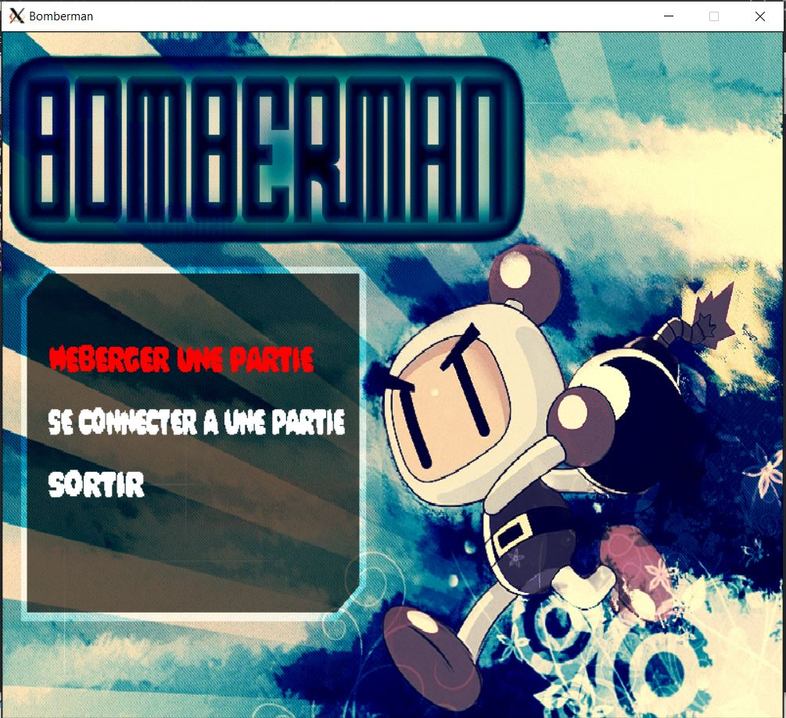
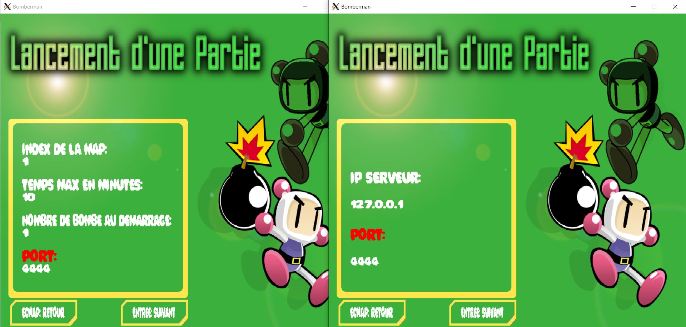
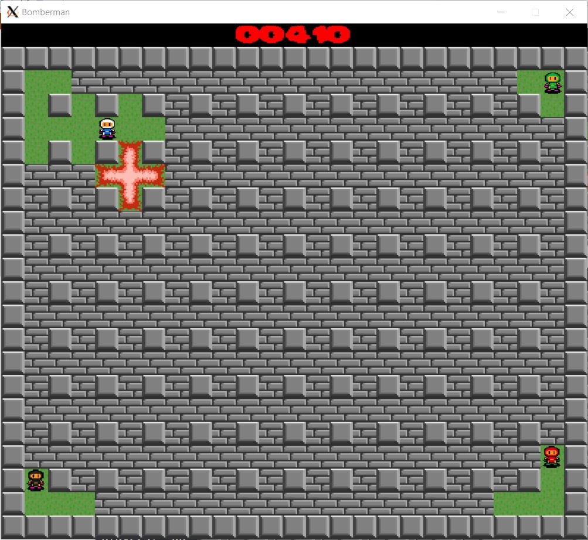

# Bomberman

## Requirements

### _Environment:_

- **Docker**  

  or

- **Linux/MacOS**
- **gcc**
- **make**
- **SDL2**
- **SDL2 image and ttf**

### _Build and run:_

- > git clone {projet}
- > cd {projet}

If using docker:
- > docker build -t bomberman .
- > docker run --rm -it -v ${PWD}:/app sdl_project

Then:
- > make
- > ./bomberman

### _Screenshot :_

  
  
  
  
  
    
  
